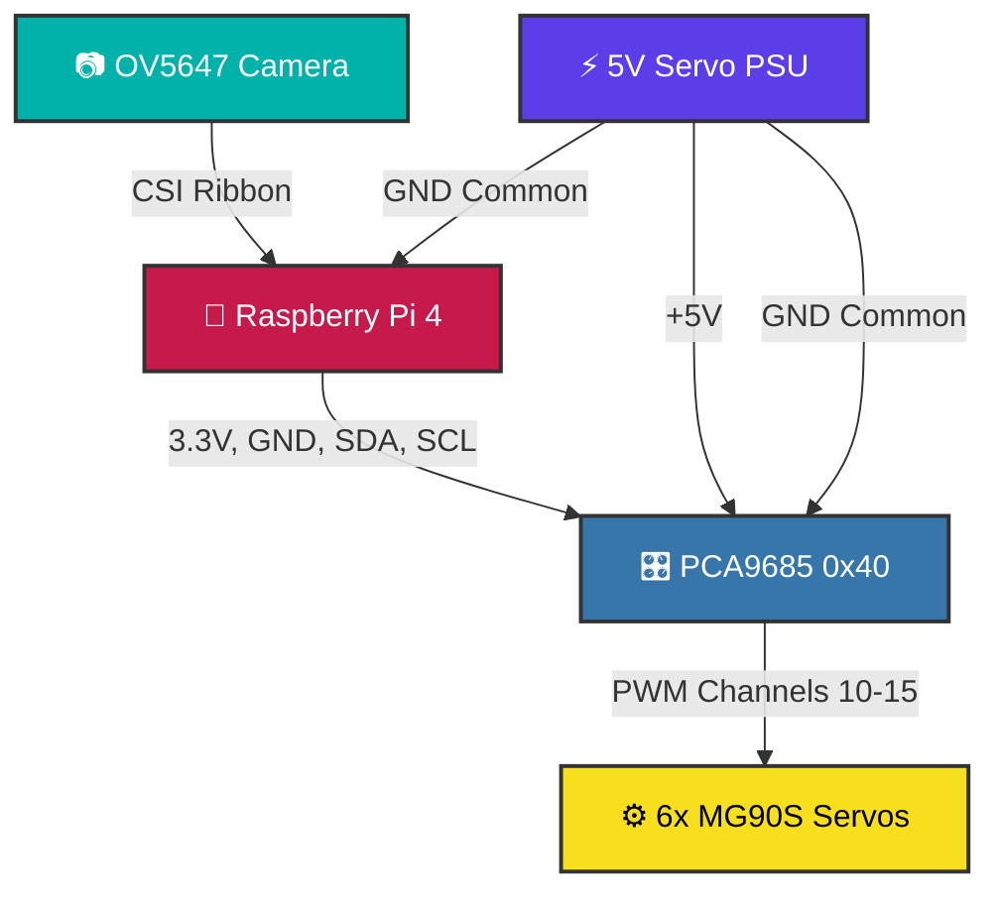

<!-- Header section with centered alignment and an animated emoji for cool design -->
<div align="center">
  <!-- Animated Robot Emoji -->
  
  
  <!-- Project Title -->
  <h1>🤖 Robot Eyes</h1>
  
  <!-- Project Tagline -->
  <p><strong>Advanced Face-Tracking Animatronic Eyes for Raspberry Pi 4</strong></p>
  
  <!-- Tech Stack Badges -->
  <p>
    <!-- Raspberry Pi Badge -->
    
    <!-- Python Badge -->
    
    <!-- OpenCV Badge -->
    
  </p>
  
  <!-- Introductory text -->
  <p><i><code>eyes.py</code> detects a face, moves the eyes, blinks the lids, and starts a slow left-right search when no person is visible.</i></p>
</div>

<!-- Divider -->
<hr>

<!-- Features Section -->
## ✨ Features

<!-- Table styling for cool look -->
| Feature | Description |
| :--- | :--- |
| 🎯 **Face tracking** | MediaPipe first, OpenCV Haar fallback |
| 📷 **Camera support** | Picamera2 first, OpenCV camera fallback |
| ⚙️ **Servo control** | PCA9685 at `0x40`, `50 Hz` |
| 👀 **Eye motion** | Left/right and up/down tracking |
| 👁️ **Eyelids** | Four-servo open, close, and blink control |
| 🔍 **Auto search** | Eyes sweep left/right when no target is locked |
| 🎮 **Manual test** | Keyboard control from the OpenCV preview window |
| 🛡️ **Safety** | Smooth startup, rate-limited movement, smooth shutdown |

<!-- Divider -->
<hr>

<!-- Quick Start Section -->
## 🚀 Quick Start

<!-- Instructions -->
Enable camera and I2C on the Raspberry Pi, install the required Python packages, then run:

<!-- Bash code block with comments for every line as per rules -->
```bash
# Update pip to ensure we have the latest package installer
python3 -m pip install --upgrade pip

# Install OpenCV, MediaPipe, PCA9685, and Motor libraries for computer vision and hardware control
pip install opencv-python mediapipe adafruit-circuitpython-pca9685 adafruit-circuitpython-motor

# Run the main Python script to launch the face-tracking eye program
python3 "eyes.py"
```

<!-- Details block for clean UI, hiding verbose controls until clicked -->
<details>
<summary><b>View Controls & Hotkeys ⌨️</b></summary>

| Key | Action |
| :--- | :--- |
| `↑↓←→` | Move eyes manually |
| `b` | Blink |
| `o` | Open eyelids |
| `c` | Close eyelids |
| `m` | Toggle manual mode |
| `a` | Toggle auto blink |
| `s` | Toggle auto search |
| `d` | Toggle debug overlay |
| `1` / `2` | LR speed down / up |
| `3` / `4` | UD speed down / up |
| `5` / `6` | Deadband down / up |
| `7` / `8` | LR gain down / up |
| `9` / `0` | UD gain down / up |
| `q` or `Esc` | Quit |

</details>

<!-- Divider -->
<hr>

<!-- Hardware Section -->
## 🛠️ Hardware & Wiring

### Components
<!-- Hardware list -->
- **Raspberry Pi 4:** Main controller
- **OV5647 CSI camera:** Face tracking
- **PCA9685 servo driver:** PWM output
- **External 5V servo supply:** Servo power
- **MG90S servos:** Eye and eyelid actuation
- **Will Cogley-style mechanism:** Mechanical assembly

### Wiring Guide
<!-- Power warning, critical for safety so users don't fry their Pi -->
> [!CAUTION]
> **IMPORTANT:** Do not power servos from the Raspberry Pi. The Pi handles logic only. The external 5V supply powers the servo rail. All grounds must be common.

<!-- Mermaid connection diagram for visual representation and cool design -->


<!-- Details block for servo mappings to keep the main view uncluttered -->
<details>
<summary><b>View Servo Map Details 🗺️</b></summary>

| Servo | Channel | Function | Limits |
| :--- | :---: | :--- | :--- |
| `LR` | `CH10` | Eyes left/right | `40` to `140` |
| `UD` | `CH11` | Eyes up/down | `60` to `140` |
| `TL` | `CH12` | Top left eyelid | `90` to `160` |
| `BL` | `CH13` | Bottom left eyelid | `90` to `30` |
| `TR` | `CH14` | Top right eyelid | `90` to `30` |
| `BR` | `CH15` | Bottom right eyelid | `90` to `140` |

*Reversed ranges are intentional for mirrored eyelid servo mounting.*

</details>

<!-- Divider -->
<hr>

<!-- Credits Section -->
## 👏 Credits

<!-- List of credits to original creators -->
- **Mechanical eye mechanism:** [Will Cogley Animatronic Eye Mechanism - Instructables](https://www.instructables.com/Animatronic-Eye-Mechanism/)
- **Alternate mechanism:** [Will Cogley / NMRobotics E-Series Eye Mechanism](https://nmrobots.com/pages/designs)

<!-- Footer section to wrap up the file nicely -->
<div align="center">
  <!-- Waving animated emoji to say goodbye -->
  
  <br>
  <!-- Final disclaimer -->
  <p><i>This repository covers the Raspberry Pi control code and wiring for this build. Use the original mechanism links for printing, assembly, and mechanical setup.</i></p>
</div>
